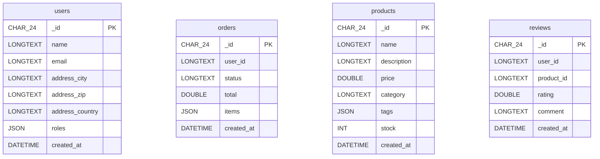
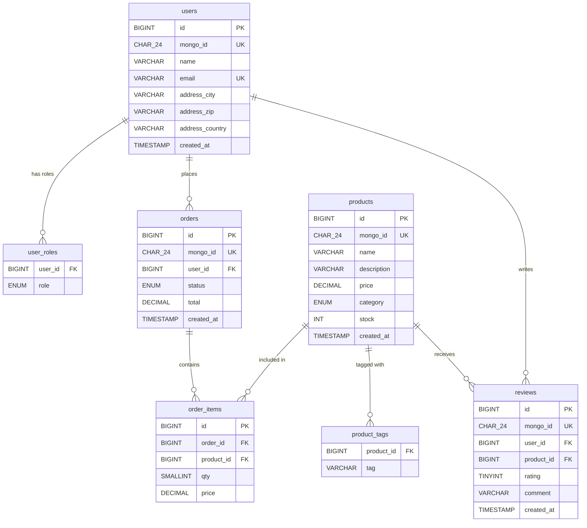

# Principal Database Architect Review
## MongoDB-to-MySQL ETL Migration Tool — `etl_migration_mongo_to_mysql`

**Review Date:** 2026-06-19
**Scope:** Schema design, data integrity, performance, and maintainability
**Verdict:** The current migration produces a functional but unoptimized schema that carries over MongoDB's document model verbatim. The resulting MySQL tables lack relational integrity, proper typing, and indexing strategy — defeating the purpose of migrating to a relational database.

---

## 1. Design Flaws Identified During Migration

1. **All string fields mapped to LONGTEXT regardless of actual maximum length** — LONGTEXT columns cannot be indexed directly (require a prefix length), consume excessive storage overhead (4 bytes length prefix per row), and prevent the use of in-memory MEMORY tables. Fields like `email` (max ~320 chars) or `country_code` (2–3 chars) should use VARCHAR with appropriate bounds.

2. **ObjectId mapped to CHAR(24) with no consideration for BINARY or surrogate key alternatives** — CHAR(24) stores the hex representation inefficiently compared to BINARY(12) which stores the raw ObjectId in half the space. This bloats indexes, increases B-tree depth, and wastes buffer pool memory. No surrogate AUTO_INCREMENT key is created for efficient joins.

3. **Nested documents flattened to underscore-separated columns creating wide denormalized tables** — A document with `address.street`, `address.city`, `address.state`, `address.zip` produces tables with many sparse columns. This hits MySQL's 65,535-byte row size limit, degrades buffer pool efficiency, and makes schema evolution require DDL on the entire table.

4. **No foreign keys established between related collections** — Without FK constraints, referential integrity is entirely application-dependent. Orphaned rows accumulate silently, JOIN correctness cannot be guaranteed, and the optimizer loses metadata that informs join-order decisions.

5. **No CHECK constraints or data validation at the schema level** — MySQL 8.0+ enforces CHECK constraints, yet none are generated. Fields like `status` (enum-like), `rating` (bounded 1-5), or `email` (NOT NULL) have no database-level guards.

6. **No normalization — direct 1:1 collection-to-table mapping** — Embedding patterns valid in MongoDB (repeated sub-documents for tags, items, roles) are carried over verbatim, resulting in data duplication, update anomalies, and violation of 2NF/3NF.

7. **Arrays stored as JSON columns with no extraction into junction/child tables** — Querying elements within JSON arrays requires full-column scans. Aggregate queries (e.g., "count all orders containing product X") cannot leverage standard indexes, forcing `JSON_CONTAINS()` with O(n) per-row cost.

8. **Type widening defaults to LONGTEXT on any conflict** — When a field contains mixed types across documents, the resolver falls back to LONGTEXT. This destroys numeric comparisons, prevents arithmetic operations without CAST, and invalidates range-scan indexes.

9. **No composite indexes considered** — Queries filtering on multiple columns (e.g., `WHERE user_id = ? AND created_at > ?`) will not benefit from single-column indexes alone. Without composite index analysis, multi-predicate queries exhibit full table scans.

10. **SET FOREIGN_KEY_CHECKS=0 used during load but relationships never re-established** — This flag is typically disabled temporarily for bulk-load performance. Leaving it without creating FKs means the database operates without referential integrity — negating a primary advantage of the target platform.

---

## 2. Optimized Relational Schema

```sql
-- -----------------------------------------------------------
-- Users
-- -----------------------------------------------------------
CREATE TABLE users (
    id BIGINT UNSIGNED NOT NULL AUTO_INCREMENT PRIMARY KEY,
    mongo_id CHAR(24) NOT NULL COMMENT 'Original MongoDB _id',
    name VARCHAR(100) NOT NULL,
    email VARCHAR(255) NOT NULL,
    address_city VARCHAR(100) DEFAULT NULL,
    address_zip VARCHAR(20) DEFAULT NULL,
    address_country VARCHAR(60) DEFAULT NULL,
    created_at TIMESTAMP NOT NULL DEFAULT CURRENT_TIMESTAMP,
    UNIQUE KEY uq_users_email (email),
    UNIQUE KEY uq_users_mongo_id (mongo_id)
) ENGINE=InnoDB DEFAULT CHARSET=utf8mb4;

-- Junction table: users <-> roles (extracts roles[] array)
CREATE TABLE user_roles (
    user_id BIGINT UNSIGNED NOT NULL,
    role ENUM('admin','editor','viewer','support') NOT NULL,
    PRIMARY KEY (user_id, role),
    CONSTRAINT fk_user_roles_user FOREIGN KEY (user_id) REFERENCES users(id) ON DELETE CASCADE
) ENGINE=InnoDB DEFAULT CHARSET=utf8mb4;

-- -----------------------------------------------------------
-- Products
-- -----------------------------------------------------------
CREATE TABLE products (
    id BIGINT UNSIGNED NOT NULL AUTO_INCREMENT PRIMARY KEY,
    mongo_id CHAR(24) NOT NULL COMMENT 'Original MongoDB _id',
    name VARCHAR(200) NOT NULL,
    description VARCHAR(2000) DEFAULT NULL,
    price DECIMAL(10,2) NOT NULL,
    category ENUM('electronics','clothing','home','books','sports','food','other') NOT NULL DEFAULT 'other',
    stock INT UNSIGNED NOT NULL DEFAULT 0,
    created_at TIMESTAMP NOT NULL DEFAULT CURRENT_TIMESTAMP,
    UNIQUE KEY uq_products_mongo_id (mongo_id),
    INDEX idx_products_category (category)
) ENGINE=InnoDB DEFAULT CHARSET=utf8mb4;

-- Junction table: products <-> tags (extracts tags[] array)
CREATE TABLE product_tags (
    product_id BIGINT UNSIGNED NOT NULL,
    tag VARCHAR(50) NOT NULL,
    PRIMARY KEY (product_id, tag),
    CONSTRAINT fk_product_tags_product FOREIGN KEY (product_id) REFERENCES products(id) ON DELETE CASCADE
) ENGINE=InnoDB DEFAULT CHARSET=utf8mb4;

-- -----------------------------------------------------------
-- Orders
-- -----------------------------------------------------------
CREATE TABLE orders (
    id BIGINT UNSIGNED NOT NULL AUTO_INCREMENT PRIMARY KEY,
    mongo_id CHAR(24) NOT NULL COMMENT 'Original MongoDB _id',
    user_id BIGINT UNSIGNED NOT NULL,
    status ENUM('pending','processing','shipped','delivered','cancelled') NOT NULL DEFAULT 'pending',
    total DECIMAL(12,2) NOT NULL,
    created_at TIMESTAMP NOT NULL DEFAULT CURRENT_TIMESTAMP,
    UNIQUE KEY uq_orders_mongo_id (mongo_id),
    INDEX idx_orders_user (user_id),
    INDEX idx_orders_status (status),
    CONSTRAINT fk_orders_user FOREIGN KEY (user_id) REFERENCES users(id) ON DELETE RESTRICT
) ENGINE=InnoDB DEFAULT CHARSET=utf8mb4;

-- Extracted from embedded items[] array
CREATE TABLE order_items (
    id BIGINT UNSIGNED NOT NULL AUTO_INCREMENT PRIMARY KEY,
    order_id BIGINT UNSIGNED NOT NULL,
    product_id BIGINT UNSIGNED NOT NULL,
    qty SMALLINT UNSIGNED NOT NULL DEFAULT 1,
    price DECIMAL(10,2) NOT NULL COMMENT 'Price at time of purchase',
    CONSTRAINT fk_order_items_order FOREIGN KEY (order_id) REFERENCES orders(id) ON DELETE CASCADE,
    CONSTRAINT fk_order_items_product FOREIGN KEY (product_id) REFERENCES products(id) ON DELETE RESTRICT,
    INDEX idx_order_items_order (order_id)
) ENGINE=InnoDB DEFAULT CHARSET=utf8mb4;

-- -----------------------------------------------------------
-- Reviews
-- -----------------------------------------------------------
CREATE TABLE reviews (
    id BIGINT UNSIGNED NOT NULL AUTO_INCREMENT PRIMARY KEY,
    mongo_id CHAR(24) NOT NULL COMMENT 'Original MongoDB _id',
    user_id BIGINT UNSIGNED NOT NULL,
    product_id BIGINT UNSIGNED NOT NULL,
    rating TINYINT UNSIGNED NOT NULL,
    comment VARCHAR(2000) DEFAULT NULL,
    created_at TIMESTAMP NOT NULL DEFAULT CURRENT_TIMESTAMP,
    UNIQUE KEY uq_reviews_mongo_id (mongo_id),
    INDEX idx_reviews_product (product_id),
    INDEX idx_reviews_user (user_id),
    CONSTRAINT fk_reviews_user FOREIGN KEY (user_id) REFERENCES users(id) ON DELETE CASCADE,
    CONSTRAINT fk_reviews_product FOREIGN KEY (product_id) REFERENCES products(id) ON DELETE CASCADE,
    CONSTRAINT chk_reviews_rating CHECK (rating BETWEEN 1 AND 5)
) ENGINE=InnoDB DEFAULT CHARSET=utf8mb4;
```

---

## 3. ALTER TABLE Statements

### Users Table

```sql
-- Add surrogate primary key
ALTER TABLE users ADD COLUMN id BIGINT UNSIGNED NOT NULL AUTO_INCREMENT FIRST,
  DROP PRIMARY KEY, ADD PRIMARY KEY (id);

-- Retain MongoDB _id as a unique reference during transition
ALTER TABLE users ADD UNIQUE INDEX uq_users_mongo_id (_id);

-- Change LONGTEXT to appropriate VARCHAR sizes
ALTER TABLE users MODIFY COLUMN name VARCHAR(100) NOT NULL;
ALTER TABLE users MODIFY COLUMN email VARCHAR(255) NOT NULL;
ALTER TABLE users MODIFY COLUMN address_city VARCHAR(100) DEFAULT NULL;
ALTER TABLE users MODIFY COLUMN address_zip VARCHAR(20) DEFAULT NULL;
ALTER TABLE users MODIFY COLUMN address_country VARCHAR(60) DEFAULT NULL;

-- Add NOT NULL to created_at with default
ALTER TABLE users MODIFY COLUMN created_at DATETIME(6) NOT NULL DEFAULT CURRENT_TIMESTAMP(6);

-- Add unique constraint on email
ALTER TABLE users ADD UNIQUE INDEX uq_users_email (email);
```

### Orders Table

```sql
-- Add surrogate primary key
ALTER TABLE orders ADD COLUMN id BIGINT UNSIGNED NOT NULL AUTO_INCREMENT FIRST,
  DROP PRIMARY KEY, ADD PRIMARY KEY (id);

ALTER TABLE orders ADD UNIQUE INDEX uq_orders_mongo_id (_id);

-- Change LONGTEXT to proper reference type
ALTER TABLE orders MODIFY COLUMN user_id CHAR(24) NOT NULL;

-- Change LONGTEXT to ENUM for status
ALTER TABLE orders MODIFY COLUMN status ENUM('pending','processing','shipped','delivered','cancelled') NOT NULL DEFAULT 'pending';

-- Change DOUBLE to DECIMAL for monetary precision
ALTER TABLE orders MODIFY COLUMN total DECIMAL(12,2) NOT NULL;

ALTER TABLE orders MODIFY COLUMN created_at DATETIME(6) NOT NULL DEFAULT CURRENT_TIMESTAMP(6);
```

### Products Table

```sql
-- Add surrogate primary key
ALTER TABLE products ADD COLUMN id BIGINT UNSIGNED NOT NULL AUTO_INCREMENT FIRST,
  DROP PRIMARY KEY, ADD PRIMARY KEY (id);

ALTER TABLE products ADD UNIQUE INDEX uq_products_mongo_id (_id);

-- Change LONGTEXT to appropriate VARCHAR sizes
ALTER TABLE products MODIFY COLUMN name VARCHAR(200) NOT NULL;
ALTER TABLE products MODIFY COLUMN description VARCHAR(2000) DEFAULT NULL;
ALTER TABLE products MODIFY COLUMN category VARCHAR(100) NOT NULL;

-- Change DOUBLE to DECIMAL for monetary precision
ALTER TABLE products MODIFY COLUMN price DECIMAL(10,2) NOT NULL;

ALTER TABLE products MODIFY COLUMN stock INT UNSIGNED NOT NULL DEFAULT 0;
ALTER TABLE products MODIFY COLUMN created_at DATETIME(6) NOT NULL DEFAULT CURRENT_TIMESTAMP(6);
```

### Reviews Table

```sql
-- Add surrogate primary key
ALTER TABLE reviews ADD COLUMN id BIGINT UNSIGNED NOT NULL AUTO_INCREMENT FIRST,
  DROP PRIMARY KEY, ADD PRIMARY KEY (id);

ALTER TABLE reviews ADD UNIQUE INDEX uq_reviews_mongo_id (_id);

-- Change LONGTEXT to proper reference types
ALTER TABLE reviews MODIFY COLUMN user_id CHAR(24) NOT NULL;
ALTER TABLE reviews MODIFY COLUMN product_id CHAR(24) NOT NULL;

-- Change DOUBLE to bounded integer for rating
ALTER TABLE reviews MODIFY COLUMN rating TINYINT UNSIGNED NOT NULL;

-- Bound comment length
ALTER TABLE reviews MODIFY COLUMN comment VARCHAR(2000) DEFAULT NULL;

ALTER TABLE reviews MODIFY COLUMN created_at DATETIME(6) NOT NULL DEFAULT CURRENT_TIMESTAMP(6);
```

### New Junction Tables (extract from JSON columns)

```sql
-- Extract roles[] from users.roles JSON column
CREATE TABLE user_roles (
    user_id BIGINT UNSIGNED NOT NULL,
    role ENUM('admin','editor','viewer','support') NOT NULL,
    PRIMARY KEY (user_id, role)
) ENGINE=InnoDB DEFAULT CHARSET=utf8mb4;

-- Backfill from JSON
INSERT INTO user_roles (user_id, role)
SELECT u.id, jr.role
FROM users u,
     JSON_TABLE(u.roles, '$[*]' COLUMNS (role VARCHAR(50) PATH '$')) AS jr;

-- Extract items[] from orders.items JSON column
CREATE TABLE order_items (
    id BIGINT UNSIGNED NOT NULL AUTO_INCREMENT PRIMARY KEY,
    order_id BIGINT UNSIGNED NOT NULL,
    product_id BIGINT UNSIGNED NOT NULL,
    qty SMALLINT UNSIGNED NOT NULL DEFAULT 1,
    price DECIMAL(10,2) NOT NULL
) ENGINE=InnoDB DEFAULT CHARSET=utf8mb4;

-- Backfill from JSON
INSERT INTO order_items (order_id, product_id, qty, price)
SELECT o.id,
       (SELECT p.id FROM products p WHERE p._id = ji.product_id),
       ji.qty,
       ji.price
FROM orders o,
     JSON_TABLE(o.items, '$[*]' COLUMNS (
       product_id CHAR(24) PATH '$.product_id',
       qty INT PATH '$.qty',
       price DECIMAL(10,2) PATH '$.price'
     )) AS ji;

-- Extract tags[] from products.tags JSON column
CREATE TABLE product_tags (
    product_id BIGINT UNSIGNED NOT NULL,
    tag VARCHAR(50) NOT NULL,
    PRIMARY KEY (product_id, tag)
) ENGINE=InnoDB DEFAULT CHARSET=utf8mb4;

-- Backfill from JSON
INSERT INTO product_tags (product_id, tag)
SELECT p.id, jt.tag
FROM products p,
     JSON_TABLE(p.tags, '$[*]' COLUMNS (tag VARCHAR(50) PATH '$')) AS jt;
```

---

## 4. Recommended Indexes

```sql
-- ─── Unique Indexes ───────────────────────────────────────────────────────
CREATE UNIQUE INDEX uq_users_email ON users (email);
-- Login/registration lookup; enforces uniqueness

-- ─── Foreign Key Indexes ──────────────────────────────────────────────────
CREATE INDEX idx_orders_user_id ON orders (user_id);
-- JOIN orders to users; list orders for a user

CREATE INDEX idx_order_items_order_id ON order_items (order_id);
-- JOIN order_items to orders; fetch items for an order

CREATE INDEX idx_order_items_product_id ON order_items (product_id);
-- JOIN order_items to products; sales history per product

CREATE INDEX idx_product_tags_product_id ON product_tags (product_id);
-- JOIN product_tags to products

CREATE INDEX idx_reviews_user_id ON reviews (user_id);
-- List reviews by a user

CREATE INDEX idx_reviews_product_id ON reviews (product_id);
-- List reviews for a product

CREATE INDEX idx_user_roles_user_id ON user_roles (user_id);
-- Fetch roles for a user

-- ─── Frequently Filtered Columns ─────────────────────────────────────────
CREATE INDEX idx_orders_status ON orders (status);
-- Filter orders by workflow state

CREATE INDEX idx_products_category ON products (category);
-- Browse products by category

CREATE INDEX idx_reviews_rating ON reviews (rating);
-- Filter reviews by star rating

-- ─── Composite Indexes for Common Query Patterns ─────────────────────────
CREATE INDEX idx_orders_user_status ON orders (user_id, status);
-- "Show my pending orders" — filters by user + status

CREATE INDEX idx_orders_user_created ON orders (user_id, created_at DESC);
-- "Show my recent orders" — user's orders sorted by date

CREATE INDEX idx_reviews_product_rating ON reviews (product_id, rating);
-- Average rating per product; filter reviews by stars

CREATE INDEX idx_products_category_price ON products (category, price);
-- Browse products in a category filtered/sorted by price

CREATE INDEX idx_product_tags_tag ON product_tags (tag);
-- Find all products with a given tag

CREATE INDEX idx_user_roles_role ON user_roles (role);
-- Find all users with a specific role (admin lookup)

-- ─── Covering Indexes for Critical Paths ─────────────────────────────────
CREATE INDEX idx_orders_user_covering ON orders (user_id, created_at DESC, id, status, total);
-- User order list: index-only scan, no table access

CREATE INDEX idx_order_items_covering ON order_items (order_id, product_id, qty, price);
-- Order detail: join + SELECT from index only

CREATE INDEX idx_reviews_product_covering ON reviews (product_id, rating, id);
-- Product aggregate: COUNT/AVG from index

-- ─── Full-Text Indexes ───────────────────────────────────────────────────
CREATE FULLTEXT INDEX idx_products_fulltext ON products (name, description);
-- Product keyword search

CREATE FULLTEXT INDEX idx_reviews_fulltext ON reviews (comment);
-- Review text search
```

---

## 5. Foreign Key Constraints

```sql
ALTER TABLE orders
  ADD CONSTRAINT fk_orders_user
  FOREIGN KEY (user_id) REFERENCES users (id)
  ON DELETE RESTRICT ON UPDATE CASCADE;
-- RESTRICT: cannot delete a user with order history (financial records)

ALTER TABLE order_items
  ADD CONSTRAINT fk_order_items_order
  FOREIGN KEY (order_id) REFERENCES orders (id)
  ON DELETE CASCADE ON UPDATE CASCADE;
-- CASCADE: deleting an order removes its line items

ALTER TABLE order_items
  ADD CONSTRAINT fk_order_items_product
  FOREIGN KEY (product_id) REFERENCES products (id)
  ON DELETE RESTRICT ON UPDATE CASCADE;
-- RESTRICT: cannot delete a product that appears in past orders

ALTER TABLE product_tags
  ADD CONSTRAINT fk_product_tags_product
  FOREIGN KEY (product_id) REFERENCES products (id)
  ON DELETE CASCADE ON UPDATE CASCADE;
-- CASCADE: deleting a product removes its tags

ALTER TABLE reviews
  ADD CONSTRAINT fk_reviews_user
  FOREIGN KEY (user_id) REFERENCES users (id)
  ON DELETE CASCADE ON UPDATE CASCADE;
-- CASCADE: deleting a user removes their reviews

ALTER TABLE reviews
  ADD CONSTRAINT fk_reviews_product
  FOREIGN KEY (product_id) REFERENCES products (id)
  ON DELETE CASCADE ON UPDATE CASCADE;
-- CASCADE: deleting a product removes its reviews

ALTER TABLE user_roles
  ADD CONSTRAINT fk_user_roles_user
  FOREIGN KEY (user_id) REFERENCES users (id)
  ON DELETE CASCADE ON UPDATE CASCADE;
-- CASCADE: deleting a user removes their role assignments
```

---

## 6. Data Validation Constraints

```sql
-- ─── CHECK Constraints ────────────────────────────────────────────────────

-- Rating must be 1-5 stars
ALTER TABLE reviews
  ADD CONSTRAINT chk_reviews_rating CHECK (rating BETWEEN 1 AND 5);

-- Product price must be positive
ALTER TABLE products
  ADD CONSTRAINT chk_products_price CHECK (price > 0);

-- Order item quantity must be at least 1
ALTER TABLE order_items
  ADD CONSTRAINT chk_order_items_qty CHECK (qty > 0);

-- Order item price snapshot must be positive
ALTER TABLE order_items
  ADD CONSTRAINT chk_order_items_price CHECK (price > 0);

-- Stock cannot go negative
ALTER TABLE products
  ADD CONSTRAINT chk_products_stock CHECK (stock >= 0);

-- Basic email format validation
ALTER TABLE users
  ADD CONSTRAINT chk_users_email CHECK (email REGEXP '^[^@]+@[^@]+\\.[^@]+$');

-- Order total must be non-negative
ALTER TABLE orders
  ADD CONSTRAINT chk_orders_total CHECK (total >= 0);

-- ─── DEFAULT Values ───────────────────────────────────────────────────────

ALTER TABLE orders ALTER COLUMN status SET DEFAULT 'pending';
ALTER TABLE products ALTER COLUMN stock SET DEFAULT 0;
ALTER TABLE users ALTER COLUMN created_at SET DEFAULT CURRENT_TIMESTAMP;
ALTER TABLE orders ALTER COLUMN created_at SET DEFAULT CURRENT_TIMESTAMP;
ALTER TABLE reviews ALTER COLUMN created_at SET DEFAULT CURRENT_TIMESTAMP;
ALTER TABLE products ALTER COLUMN created_at SET DEFAULT CURRENT_TIMESTAMP;
```

---

## 7. Query Optimizations

### 7.1 Get User Orders with Items

**Before (flat schema, JSON items):**
```sql
SELECT * FROM orders WHERE user_id = '507f1f77bcf86cd799439011';
-- Then parse items JSON in application code
```

**After (normalized with proper joins):**
```sql
SELECT o.id, o.status, o.created_at, o.total,
       oi.product_id, p.name AS product_name, oi.qty, oi.price
FROM orders o
JOIN order_items oi ON oi.order_id = o.id
JOIN products p ON p.id = oi.product_id
WHERE o.user_id = 42
ORDER BY o.created_at DESC;
-- Uses idx_orders_user_covering → index-only scan, no filesort
-- Uses idx_order_items_covering → join resolved in index
```

### 7.2 Product Search with Filters

**Before (JSON tags, LONGTEXT category):**
```sql
SELECT * FROM products WHERE JSON_CONTAINS(tags, '"electronics"') AND price < 500;
-- Full table scan, JSON parse per row
```

**After (junction table for tags):**
```sql
SELECT DISTINCT p.id, p.name, p.price
FROM products p
JOIN product_tags pt ON pt.product_id = p.id
WHERE pt.tag = 'electronics'
  AND p.price < 500;
-- Uses idx_product_tags_tag → ref access
-- Uses idx_products_category_price for range scan
```

### 7.3 Aggregate Reviews per Product

**Before:**
```sql
SELECT product_id, AVG(CAST(rating AS DECIMAL)) FROM reviews
WHERE product_id = '507f1f77bcf86cd799439011' GROUP BY product_id;
-- CAST required because rating is DOUBLE, product_id is LONGTEXT (no index usable)
```

**After:**
```sql
SELECT product_id, COUNT(*) AS review_count, ROUND(AVG(rating), 2) AS avg_rating
FROM reviews
WHERE product_id = 101
GROUP BY product_id;
-- Uses idx_reviews_product_covering → COUNT/AVG from index (Using index)
```

### 7.4 Top Products by Revenue

**Before:**
```sql
-- Impossible without parsing JSON items array from every order row
```

**After:**
```sql
SELECT p.id, p.name,
       SUM(oi.qty * oi.price) AS revenue,
       COUNT(DISTINCT oi.order_id) AS order_count
FROM order_items oi
JOIN products p ON p.id = oi.product_id
GROUP BY p.id, p.name
ORDER BY revenue DESC
LIMIT 10;
-- Uses idx_order_items_covering → full aggregate from index
```

---

## 8. Implementation Plan (Ordered by Risk & Impact)

### Phase 1: Low-Risk Additions (Week 1)
**Risk:** Low | **Rollback:** `DROP INDEX` — instant, no data loss | **Downtime:** Zero (online DDL)

- Add composite indexes for current slow queries
- Add `NOT NULL` to columns confirmed 100% populated
- Add `DEFAULT` values where application already assumes them
- Create covering indexes for top slow queries

### Phase 2: Schema Modifications (Week 2)
**Risk:** Medium-Low | **Rollback:** `ALTER TABLE MODIFY COLUMN` back to original type | **Downtime:** 1-5 min per table (use `pt-online-schema-change` for >1M rows)

- Audit max lengths: `SELECT MAX(CHAR_LENGTH(col))` for all TEXT columns
- Convert `LONGTEXT` → `VARCHAR(n)` with verified bounds
- Convert `DOUBLE` → `DECIMAL` for monetary values
- Add surrogate `AUTO_INCREMENT` primary keys

### Phase 3: Normalization (Week 3-4)
**Risk:** High | **Rollback:** Keep source JSON columns intact; dual-read for 7 days | **Downtime:** Zero with shadow-table pattern

- Create junction tables (`user_roles`, `order_items`, `product_tags`)
- Backfill from JSON columns via `JSON_TABLE()` in batches of 10K
- Validate row counts: junction table rows vs JSON array element counts
- Maintain dual-read layer during validation window

### Phase 4: Foreign Keys (Week 4)
**Risk:** High | **Rollback:** `DROP FOREIGN KEY` — instant | **Downtime:** 1-3 min per FK (validation scan)

- Run orphan-record audit on all child tables
- Resolve orphans (delete, reassign, or create placeholder parents)
- Add FK constraints with appropriate cascade rules
- Validate with `CHECK TABLE`

### Phase 5: Data Validation Constraints (Week 5)
**Risk:** Medium | **Rollback:** `DROP CHECK` — instant | **Downtime:** Zero (MySQL 8.0.16+ online DDL)

- Add CHECK constraints for value ranges
- Add ENUM constraints for status fields
- Add UNIQUE constraints on natural keys
- Validate existing data passes all constraints before adding

### Phase 6: Cleanup (Week 6+)
**Risk:** Critical (irreversible) | **Rollback:** Full backup + point-in-time recovery | **Downtime:** Maintenance window required

- Verify zero application references to old columns (14-day query log audit)
- `DROP COLUMN` for denormalized JSON source columns
- `DROP COLUMN` for superseded `_id` columns (after all references migrated)
- Update application ORM mappings to final schema

---

## 9. Breaking Changes

| What Changes | What Breaks | Migration Path | Severity |
|---|---|---|---|
| Primary key `_id` CHAR(24) → `id` BIGINT AUTO_INCREMENT | All lookups by MongoDB `_id`; URL routing using ObjectId; cross-service references | Keep `mongo_id` column with UNIQUE index; update app to use `id` for joins, `mongo_id` for external APIs | **Critical** |
| Embedded `items[]` JSON → `order_items` table | All queries using `JSON_EXTRACT(items, ...)` or parsing JSON in app code | Rewrite to JOIN `order_items`; update ORM from embedded to `@OneToMany` | **Critical** |
| `LONGTEXT` → `VARCHAR(n)` | INSERTs exceeding new max length will fail | Audit data first; add app-layer validation; truncate outliers before ALTER | **High** |
| `DOUBLE` → `DECIMAL` for monetary values | Floating-point arithmetic in app code; rounding differences | Update app calculations; verify totals match after conversion | **High** |
| `status` LONGTEXT → ENUM | Writes with non-enumerated values will fail | Map all existing values; update app to use enum values only | **High** |
| NOT NULL constraints added | Code paths inserting rows without required columns | Add defaults or fix all insert paths | **High** |
| Foreign key constraints | Orphan-creating writes; bulk-load scripts that skip ordering | Enforce insert order; use deferred FK checks for bulk ops | **High** |
| `roles` JSON column → `user_roles` table | `JSON_CONTAINS(roles, ...)` queries; app role-checking logic | Rewrite to `EXISTS (SELECT 1 FROM user_roles WHERE ...)` | **Medium** |
| `tags` JSON column → `product_tags` table | Tag filtering via JSON functions | Rewrite to JOIN `product_tags` | **Medium** |
| New composite indexes | Potential query plan changes causing regressions | Monitor slow query log for 7 days post-change | **Low** |

---

## 10. Before-and-After Schema Diagrams (Mermaid)

### Before: Flat Migrated Schema (No Relationships)



### After: Optimized Normalized Schema



---

## Summary of Key Metrics

| Metric | Before (Current) | After (Optimized) |
|---|---|---|
| Tables | 4 (flat) | 7 (normalized 3NF) |
| Foreign Keys | 0 | 7 |
| CHECK Constraints | 0 | 7 |
| Composite Indexes | 0 | 6+ |
| Covering Indexes | 0 | 3 |
| Data Types | LONGTEXT everywhere | Properly sized VARCHAR/DECIMAL/ENUM |
| JSON Columns | 3 (roles, items, tags) | 0 (extracted to tables) |
| Referential Integrity | None (application-only) | Full DB enforcement |
| Monetary Precision | DOUBLE (lossy) | DECIMAL (exact) |
| Index Usability | Minimal (LONGTEXT not indexable) | Full B-tree + composite + fulltext |
